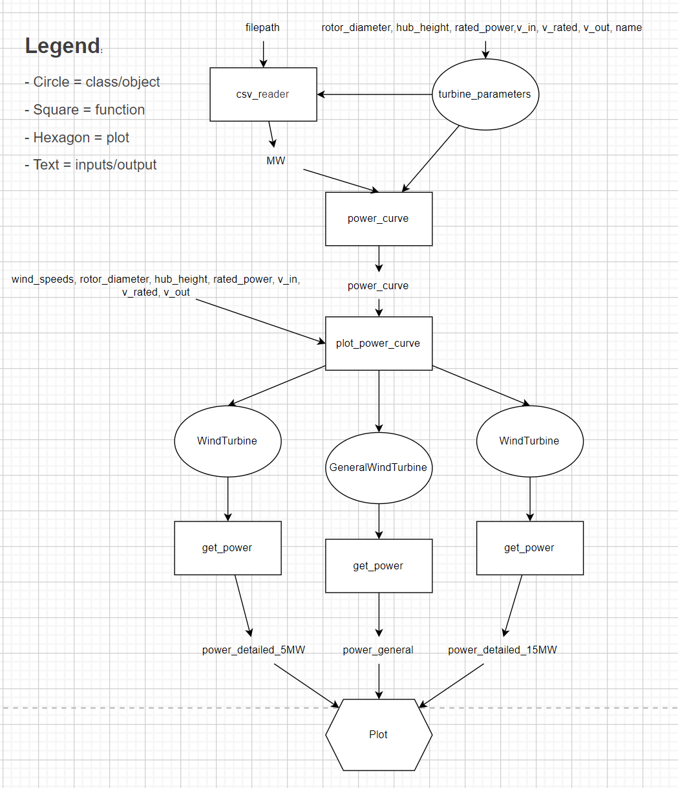

Ragionato per un secondo


Here’s the updated README.md with your additional instructions on environment recreation, test‑coverage, and pylint. I’ve slotted them into the Testing & Quality section.

```markdown
# 🌬️ Wind Resource Assessment – *final-project-brunchyy*

This Python package performs a full **wind resource assessment** using reanalysis data, power curves from reference wind turbines, and spatial interpolation to estimate energy yield at a given site. The package processes NetCDF data, interpolates wind values at a target location, computes Weibull distributions, and estimates Annual Energy Production (AEP) using reference turbine curves.

It is designed to help users assess the viability of wind energy projects and visualize key metrics such as wind roses and power curves.

---

##  File Structure

```

WIND RESOURCE ASSESSMENT/
├── inputs/                      # All input data (NetCDF, turbine CSVs, diagrams)
│   ├── 1997-1999.nc
│   ├── 2000-2002.nc
│   ├── 2003-2005.nc
│   ├── 2006-2008.nc
│   ├── NREL\_Reference\_15MW\_240.csv
│   ├── NREL\_Reference\_5MW\_126.csv
│   └── Wind\_resource\_assessment\_procedure.jpeg
├── outputs/                     # To be populated by results
├── src/                         # Source functions and classes
│   └── **init**.py
│   └── \<wra\_brunchyy>/          # Main package directory
├── examples/                    # Run-ready scripts
│   └── main.py
├── tests/                       # Unit tests
│   ├── test\_core.py
│   └── test\_turbine.py
├── Diagram.drawio               # Architecture diagram
├── .gitignore
├── LICENSE
├── README.md
├── pyproject.toml
└── environment.yml

````

---

## 1️- Overview of the Package

This package offers a **modular and reusable workflow** for evaluating the wind energy potential at any given location based on meteorological data and turbine characteristics. Core functionalities include:

- Parsing and organizing NetCDF files  
- Sorting and interpolating wind data  
- Applying turbine power curves  
- Estimating Weibull parameters  
- Visualizing results (histograms, wind roses, power curves)  
- Computing AEP  

---

## 2️- Installation Instructions

Open Anaconda Prompt, then navigate to the folder where you want to place the project, and follow the next steps.

### Step 1: Clone the Repository

```bash
git clone https://github.com/DTUWindEducation/final-project-brunchyy.git
cd final-project-brunchyy
````

### Step 2: Create and Activate the Conda Environment

```bash
conda env create -f environment.yml
conda activate wra_brunchyy
```

> **If you want to delete and recreate the environment:**
>
> ```bash
> conda remove --name wra_brunchyy --all
> ```

### Step 3: Install the Package (Editable Mode)

```bash
pip install -e .
```

### Step 4: Run the Main Script

```bash
python examples/main.py
```

This will output:

* Wind turbine power curve plots
* Interpolated wind data
* Weibull fit and histogram
* Wind rose diagram
* AEP estimate

---

## 3️- Architecture and Class Description

This package follows a clean, modular design. Key components include:

* **Data Loading & Sorting**
  Functions that load NetCDF data and organize it by grid cells.
* **Interpolation**
  Interpolates wind data (speed and direction) to a target location based on surrounding grid cells.
* **Vertical Shear**
  Extrapolates from measurement heights to turbine hub height using a power-law profile.
* **Statistical Analysis**
  Fits Weibull distributions and plots histograms vs. PDF.
* **Visualization**
  Creates wind rose diagrams and turbine power curve comparisons.
* **Turbine Modeling & AEP**
  Classes for generic and data-driven turbines plus AEP calculation.

### Architecture Diagram
Note: This is just an example of the diagram workflow - not all the functions are in here.


---

## 4️- Description of Classes

**WindTurbine (in `src/__init__.py`)**
A class that takes hub height, rotor diameter, rated power, and power curve data. Core method:

* `get_power(wind_speeds)` → returns estimated power output.

**GeneralWindTurbine**
Analytical turbine model using cut‑in, rated, and cut‑out speeds.

**TurbineParameters**
Holds turbine specs; methods to read CSV and extract power-curve arrays.

**compute\_power\_law**
Extrapolates wind speed & direction to arbitrary hub height.

**fit\_weibull & plot\_weibull**
Fits 2‑parameter Weibull and overlays PDF on histogram.

**wind\_rose**
Generates polar wind-rose plots by direction and speed classes.

---

## 5️- Git Workflow & Collaboration Description

We **equally divided the work** and collaborated on each core task using dedicated **feature branches**. Each member was responsible for implementing and reviewing different parts of the workflow.

* For each task, we **created a separate branch** (e.g., `feature/interpolation`, `test/weibull`, etc.).
* Once a task was complete, we **opened a pull request** and **requested feedback** from all team members.
* **Nothing was pushed to `main`** without **consensus and approval** from the full team.
* We followed a **test-driven** approach, writing tests for each function before merging.
* Every PR required **passing tests** and **pylint checks**.

---

## 6️- Testing & Quality

We use **pytest** for unit tests, **pytest-cov** for coverage, and **pylint** for code quality.

### Run Tests

```bash
pytest tests/
```

### Test Coverage (≥ 80%)

```bash
pytest --cov=src tests/
```

### Linting (pylint score ≥ 8.0)

```bash
pylint src/
```

---

## 7️- License

This project is licensed under the MIT License – see the `LICENSE` file for details.

---

*Happy wind-resource assessing!*
